{{first:2021-04-08}}

# 議案第17号　小平市立障害者福祉施設条例の一部を改正する条例

<i class="fa fa-gavel" aria-hidden="true"></i> 厚生委員会付託

📄会議録（まだ公開されていません）（<a href="https://ssp.kaigiroku.net/tenant/kodaira/SpTop.html">初日</a>｜<a href="https://ssp.kaigiroku.net/tenant/kodaira/SpTop.html">委員会</a>｜<a href="https://ssp.kaigiroku.net/tenant/kodaira/SpTop.html">最終日</a>）

<fieldset class="point">
  <legend>
    <h2> ポイント </h2>
  </legend>
  <ul>
    <li class="chk">初の「児童発達支援センター」を小平市障害者福祉センター内に新設するための条例改正</li>
    <li class="chk">機能が追加されるため、小平市障害者福祉センターを「たいよう福祉センター」に改名</li>
    <li class="chk">発達支援相談、保護者への支援、障害児にかかる研修、啓発に関することを新たに規定</li>
  </ul>
</fieldset>

<fieldset class="sanpi">
  <legend>
    <h2>⭕️ 私（安竹洋平）の判断：賛成 </h2>
  </legend>
  <ul>
    <li>以下の問題はあるものの、まずは児童発達支援センターの導入が必要であるため賛成</li>
    <li class="ng">言語訓練のリソース不足に対する対策が取られていない</li>
    <li class="ng">教育委員会との連携がうまくとれていない状態が続いたまま</li>
    <li class="ng">18歳未満の発達障害児潜在数2,000人に対し、規模が小さすぎるのではないか</li>
  </ul>
</fieldset>

## 市長提案説明

> 本案は、[小平市立障害者福祉センター](http://www.syakaifukushi.kodaira.tokyo.jp/modules/facilities/index.php?id=2)の正式名称を、現在使用している愛称に変更するとともに、当該施設に児童発達支援センターを設置し、新たな事業を実施するため、改正するものです。
>
> 改正の内容ですが、第1点目として、小平市立障害者福祉センターの名称を、小平市立たいよう福祉センターに変更いたします。
>
> 第2点目として、小平市立たいよう福祉センターで新たに実施する発達支援相談、保護者への支援、並びに障がい児にかかる研修、及び啓発に関することを規定いたします。
>
> 第3点目として、児童発達支援センターの設置に伴い、施設内に設置している音楽室、及び録音室を廃止するため、規定を削除いたします。
>
> 第4点目として、その他、引用条項の整理を行うものです。
>
> 施行期日につきましては、第1点目から第3点目までは、来年4月1日を、第4点目は、公布の日を予定いたしております。

## 解説

小平市における児童発達支援センター設立の経緯は、次の報告書に記載されています。

[小平市児童発達支援センター検討委員会報告書（平成31年3月）](https://www.city.kodaira.tokyo.jp/kurashi/075/075432.html)

> 平成２４年の児童福祉法改正により、障がいのある子どもが身近な地域で適切な支援が受けられるように、児童発達支援が位置づけられました。また、国が指針を改正し、市町村が策定する平成３０年度から平成３２年度までの[第五期障害福祉計画及び第一期障害児福祉計画](https://www.mhlw.go.jp/stf/seisakunitsuite/bunya/0000163638.html)においては、児童発達支援センターを各市町村に少なくとも１か所以上設置することを基本とする成果目標が設定されました。
>
> 小平市においては平成２８年度に、発達障がいの子どもへのワンストップの相談窓口を作り、様々な関係機関と有機的な支援体制を構築していくために、[小平市発達支援相談拠点検討委員会](https://www.city.kodaira.tokyo.jp/kurashi/050/050719.html)を設置し議論を行ってきました。そこでは小平市にある専門機関を有機的につなげ、円滑な連携やコーディネートを推進していく機関として、発達支援相談拠点の設立とそれに付随する市役所内の発達支援部署の必要性を提言しました。
>
> 今回の[児童発達支援センター検討委員会](https://www.city.kodaira.tokyo.jp/kurashi/075/075428.html)ではそれをより広げ、発達障がいにかかわらず、すべての子どもとその保護者が発達に関する相談ができる場所として児童発達支援センターを構想してきました。発達支援相談拠点で議論されたことをベースに、ワンストップでコーディネートができる機能を持った中核的な児童発達支援センターであり、ライフステージによって支援が途切れることなく、一貫して子どもの育ちに寄り添える相談機関としての役割を持つことが委員会として一致した考えです。そのためには、市として発達支援担当部署を持ち関係機関と連携して、医療・福祉・教育・就労など発達支援に関わるネットワークを形成していくことの必要性が改めて確認されました。

参考：[厚生労働省 > 障害児支援施策](https://www.mhlw.go.jp/stf/seisakunitsuite/bunya/0000117218.html)

平成24年の児童福祉法と障害者自立支援法の改正に伴い、児童福祉法に根拠規定が一本化されました。同時に、障害児の支援強化を図るため、障がい種別ごとに分かれていた施設体系が通所・入所の利用形態別に一元化されました。

障害児施設・事業の一元化は、障害児が身近な地域で支援が受けられるようにするため「児童発達支援」に再編。従来、「児童福祉施設」として定義されていたものを「児童発達支援センター」とし、それ以外を「児童発達支援事業」と分けました（上図）。従来の障害児通所施設・事業は、医療の提供（医療法上の診療所の指定）の有無により、「児童発達支援」または「医療型児童発達支援」のどちらかに移行することとされました。

今回、市で新設する児童発達支援センターは、このうちの福祉型児童発達支援センターです。

児童発達支援センターは、施設の有する専門機能を活かし、地域の障害児やその家族からの相談、障害児を預かる施設への援助・助言を合わせて行うものです。通所利用者に対してだけではなく、地域の中核的な療育支援施設と位置付けられているものです。

（[小平市児童発達支援センター検討委員会報告書（平成31年3月）](https://www.city.kodaira.tokyo.jp/kurashi/075/075432.html)より抜粋して編集）

上図は、厚労省作成資料[（障害者自立支援法等の一部を改正する法律案の概要）](https://www.mhlw.go.jp/file/06-Seisakujouhou-12200000-Shakaiengokyokushougaihokenfukushibu/0000117930.pdf)の図がもとになっています。

## 主な質疑（発言順）
{{#include ../partials/situgi_hanrei.md}}

### ① 本会議での質疑
① 本会議での質疑はありませんでした。

### ② 厚生委員会での質疑

厚生委員会には、一人会派の会から私（安竹洋平議員）が委員として参加しています。

他会派の議員 

市は、児童発達支援センターの開設で何を期待しているか。

岡田 障がい者支援課長 

発達障害を抱える障害児あるいは家族の方々への対応が、ある程度一元化され、いろいろな相談を、迷うことなく児童発達支援センターで行い、適切な対応を、少しでも分かりやすく、その障害児に沿った対応ができる場所として、続けられるとよいと考えている。

他会派の議員 

児童発達支援センターの相談窓口対応は、どういう資格の方が担うか。

岡田 障がい者支援課長 

何年か前に公認心理士など新たな資格ができたり、臨床心理士を持っている方がうまくやってもらえるとよい。その他には、社会福祉士、精神保健福祉士、言語聴覚士、作業療法士、それぞれ一長一短ある。その希望・要望を聞きながら、令和4年度予算の中で最終的に判断していく。

他会派の議員 

資料の図に「保育所等訪問支援などの実施」とあるが、詳細は。

また、保育所等の等とは何か。

岡田 障がい者支援課長 

保育所等訪問支援は、保育所等を訪問し、障害児に対して、障害児以外の児童との集団生活への適応のための専門的な支援などを行う。巡回相談とは違い、保護者の側から要望などをもらい、事業を実施していくもの。

「等」の部分は、保育園、幼稚園、小学校、中学校、特別支援学校、認定こども園、その他、児童養護施設なども対象になるのでは。

他会派の議員 

代替施設への移行で子どもたちの環境も大きく変化する。配慮は。

岡田 障がい者支援課長 

指定管理者の社協にお願いする。市が直接対応するわけではない。市は、環境に配慮することが大きな仕事。児童発達支援、生活介護に通っている障害者、障害児の方々への配慮は、きちっと社協のほうにお願いしたい。

他会派の議員 

正規職員と会計年度任用職員との割合は。

岡田 障がい者支援課長 

児童発達支援センターの設置基準、人員基準なども基本的に法律で定められている。嘱託医を置く、児童指導員及び保育士は、通例の児童発達支援以上の配置を行う。栄養士が1人以上、調理員を1人以上、あとは管理責任者等を置く形になっている。その関連性から調理室が必須となっている。

発達支援相談窓口の配置については基準がないので、その専門職の方々を、発達支援相談窓口の対応ができるような方々としてお願いしていきたい。

正規職員と非常勤職員の比率は予算対応の話なので、今後の調整。

⭐️ 安竹洋平議員 

児童発達支援センターは、児童発達支援事業である「あすの子園」と別に新設するわけではなく、あすの子園の機能を使いつつ、そこにワンストップ対応の相談機能等を追加するという理解でよいか。

岡田 障がい者支援課長 

御理解のとおり。

⭐️ 安竹洋平議員 

小平市内で発達障害の児童数はどれくらいか。また、今後の推移想定は。

岡田 障がい者支援課長 

児童数の6～7%といわれている。医療の発達等で増えているととらえている。

（人数では）ゼロ歳児から18歳児までの人口の割合で出すと、2,000人程度。

小平市立の小学生では約600人、中学生が約250人、合計約850人（6%計算）。

⭐️ 安竹洋平議員 

児童発達支援センター利用定員数の想定は。あすの子園の利用定員と同じか。

岡田 障がい者支援課長 

今までどおり24人の定員で今後も行っていく。

⭐️ 安竹洋平議員 

あすの子園で実施している、機能訓練、言語訓練、音楽活動の実施回数は。たとえば1人当たりの言語訓練は1ヵ月に1回1時間の枠と思われるが、その実施回数と時間は。

また、1人当たりの時間として十分に足りているか。

岡田 障がい者支援課長 

あすの子園は基本的に保育園の代替的なところとして実施していると考えている。24人の登録を3年間続けてもらう対応をしている。

⭐️ 安竹洋平議員 

あすの子園の音楽活動は、音楽室を使ってのことだったか。音楽室がなくなることで影響は。

岡田 障がい者支援課長 

今回、音楽室を調理室に変えるため、多目的ホールを増築する。音楽だけではないが、そこで実施継続していく。

⭐️ 安竹洋平議員 

市民の方から、重要な役割を担う「言語訓練」でリソースが足りていないという御意見がある。

自分の子どもが発達障害だと分かったら、初めのころは、どうすればよいか分からない。情報も少ない中、月に1時間、1枠しか言語訓練が受けられないとなれば、不安の中で過ごすことになる。

言語訓練は2年間の期限があり、そこでパタっと終わる。その後のフォローがない。そういったことは児童発達支援センターができると改善されていくのか。20年以上そういう状況が続いているという市民の方もいる。

岡田 障がい者支援課長 

これまで長年、小平市の先駆的な事業として、市の単独事業で実施してきた。そういう面でかなり周知が行き届き、日ごろからの満杯状態が現状と考えている。現在は、たいよう福祉センターとあおぞら福祉センターの3ヵ所ずつ計6ヵ所で、代わる代わるお願いしている状況。

2年というのをスタンスとして実施し、新たな子たちも受け入れながら対応している。フォロー体制は今後の検討課題。

⭐️ 安竹洋平議員 

教育委員会と児童発達支援センターの連携ができていないと、2年間で言語訓練が終わった後、たとえば小学校1年生～2年生の時点で、また一から説明するなど、状況を分かってもらわなくてはならない。

言語訓練が2年間で終わってから、教育委員会とちゃんと連携できるような体制ができているか。

岡田 障がい者支援課長 

今回、第二期の障害児福祉計画も策定する方向。特別支援教育のほうでも計画を立てている。そことの連携は、今後は、これまで以上に密な連携を図っていくことを想定している。

平成30年度に児童発達支援センターの検討委員会を行った際、同様に庁内委員会も行った。そこでの話の中でも、教育委員会との連携は俎上に乗っており、今後具体化していくべきものとして考えている。就学後の気付きとして、小・中学校の先生方との対応も含めて連携をしていくということは、ひとつのテーマとして行っていくべきと思っている。

⭐️ 安竹洋平議員 

就学後に気付く発達障害だと、障がい者支援課と接点がなくなってしまう。教育委員会と障がい者支援課が密接に連携していただきたい。全国で6割以上の自治体が導入している「教育支援センター」の設置を、小平市は視野に入れているのか。

<strong>🕵 教育支援センターを設置している周辺自治体の例</strong>

- [武蔵野市](http://www.city.musashino.lg.jp/kurashi_guide/sho_chugakko/kyoikusodan/1007045.html)
- [立川市](https://www.city.tachikawa.lg.jp/shido/tekioushidou.html)
- [練馬区](https://www.city.nerima.tokyo.jp/kosodatekyoiku/kyoiku/gakko/kyoikucenter/index.html)

小平市は「教育支援室」、西東京市は「教育相談センター」、清瀬市は「教育相談室」、東大和市は「教育センター」などが設置されている。しかし、教育支援センターに求められている機能とは違うのではないかと思われる（要確認）。

岡田 障がい者支援課長 

具体的に把握していない。別の機会にお話できれば。

⭐️ 安竹洋平議員 

言語訓練は月に1回1時間しかできない。リソースが限られているなら、集中と選択を進めればよい。たとえば、発達障害が分かったばかりのお子さんは週に1回など、回数を増やす。その後、様子を見て回数を減らしていけばよい。また、同じような状況のお子さんは2人同時に見られるようする。そういった意見があるが、どうか。

障害が分かったときに手厚くしておかないと二次障害も出てくる。どう考えているか。

岡田 障がい者支援課長 

言語相談訓練については、今まさに社協との調整も図りながら、その機能について検討している。どういったタイアップをしていくか、今後の児童発達支援センターの進むべき内容にどう関わってくるか、きちっと検討していきたい。

滝澤 健康福祉部長 

言語訓練は、御相談をいただき、まず職員が面談をする。その後、言語聴覚士、児童発達心理士などの専門職が個別に面談をし、どのくらいのペースで言語訓練をやっていくかを決めている。発達障害をすべて言語訓練だけで解決できるわけではない。発達障害のお子さんは、集団の中でどう生活していくかが大きい。

そのひとつとして、コミュニケーションや発語を訓練するのが言語訓練。お子さんの訓練だけではなく、同時に保識者の方への指導も併せて行っている。普段から関わる保謹者の方、通っている保育園や幼稚園、集団の中でほかの人とどう関わっていくかというところが、日々の生活で大事になってくる。そのお子さんに合った回数というのは専門家が判断し、訓練の日程を決めている。

2人一緒にというのは、どうしてもほかのお子さんが気になったり、指示が入らなかったりもある。発達障害のお子さんを集団で訓練していくのは、難しいと考えている。

⭐️ 安竹洋平議員 

言語訓練は、お子さんに応じて時間を決めているということは、月に1回1時間という枠があるわけではないということなのか。お子さんによって月に数時間の枠が取れたり、そういう状況なのか。

滝澤 健康福祉部長 

月に1回ということ。月に2回受けているお子さんもいる。それは言語聴覚士の判断であったり、お子さんの状態であったりということによる。場合によっては、枠が取れず、本当は月に2回受けさせてあげたいけれども1回になるということは、たしかにある。

⭐️ 安竹洋平議員 

本来、（潜在人数2,000人の）すべての発達障害のお子さんを支援する状態が望ましい。そうすると利用定員24人では足りなくなるのでは。

言語訓練も満杯。さらに言語訓練を拡充していく場合、施設の容量が足りないのではないか。

施設として十分な対応ができていないという判断が出たとき、どうするか。施設を拡充したり、場所を用意して新たに児童発達支援センターを作ったり、小金井市にある「きらり」などを連携して使わせてもらったり、そういったことは想定しているか。

滝澤 健康福祉部長 

言語訓練に通っている方は、保育園や幼稚園に通いながら、たいよう福祉センターやあおぞら福祉センターに来て言語訓練を受けている方がほとんど。

保育園なり幼稚園なり、集団での生活が難しい方については、あすの子園で療育を行っている。この療育は、最近、民間の社会福祉法人でもいくつか実施している。市内にそういったところがかなり増えてきたので、保護者の方が選んで、お子さんに合ったところを選択していくことになると思う。そのため、障害者福祉センターの中のあすの子園が、今、定員24人で、施設の規模としても、これ以上の受け入れは厳しい状況。

民間だったり、今回、児童発達支援センターを作ることで保育所等支援も行うので、違う保育園等に通いながら、専門家の支援を受けるといったことも可能になるので、そういったところで対応していければと考えている。

⭐️ 安竹洋平議員 

言語訓練は、全員受けさせたいけれども予算がないということなのだろう。言語訓練をちゃんと受けられないことで、学校に行けなくなることもある。

収入等の面でなかなか民間のほうにも行けない。

発達障害で不登校になる可能性が結構あると思うので、手厚くしてもよい部分だと私は思う。それは予算を決めるほうの話なので、ぜひ要望を強く出していただきたい。

人数が足りていないことは、民間の事業者を使ってくださいということで、児童発達支援センターを追加でつくるとか、他市の施設を使わせてもらい連携していくといったことは、考えていないという理解でよいか。

岡田 障がい者支援課長 

福祉型児童発達支援センターについては、障害福祉サービスの一環で、今回は市としてセンターの設置を進めているが、社会福祉法人であったりNPOの団体がつくることも可能。今後つくりたいというところに関しては、市としての検討は必要と考えている。

滝澤 健康福祉部長 

言語訓練は、特に予算がないからやらないというわけではない。必要に応じて社協のほうから予算措置が上がってくるし、我々としても内容をよく精査し、本当に言語訓練が必要であれば予算の計上はしている。ただ、それを受け入れるほうの体制というか、言語聴覚士の確保や、そういったところには課題があると考えている。

なるべく受ける側としても、お子さんを早めに、早期発見、早期治療ではないが、そういったことをしていきたいという思いは現場のほうもある。当然、訓練する言語聴覚士もそういう思いは持っており、できる限り受けさせてあげたいということは、現場も市としても同じ考えということで認識している。

他会派の議員 

調理室は、あすの子園へ通う子どもたちに給食を提供するためのものか。

岡田 障がい者支援課長 

調理室は、児童発達支援センターに必須の施設として設置しなければならない。いろいろ検討したが、現状としては、児童発達支援事業あすの子園の利用者である障害児に給食を提供すると考えている。

他会派の議員 

たいよう福祉センターで受ける言語訓練と、ほかのリハビリの専門的な病院で行う言語訓練と、同じ訓練を行っているのか。

だとしたら、なぜたいよう福祉センターを選んで受けている人がいるのか。

岡田 障がい者支援課長 

言語相談訓練の内容は、大幅にリハビリ専門病院との違いはないと思うが、いろいろな方法論があると思うので、元来は、どちらに行っても必要な対応は図られていると考えている。

小平市としては言語相談訓練を先駆的に行ってきたというところでは、先ほど安竹委員のお話もあったが、基本的に無料で行っている。病院は基本的には医療になるので、そういったところが大きな違いになるのと考えている。

### 厚生委員会での採決

全委員が賛成⭕️

## 本会議でのやり取り

### 討論

なし

### 採決

全議員が賛成⭕️

## 原案に対する賛否
[賛否一覧はこちらをご覧ください。](../kekka-ichiran.md#賛否)

