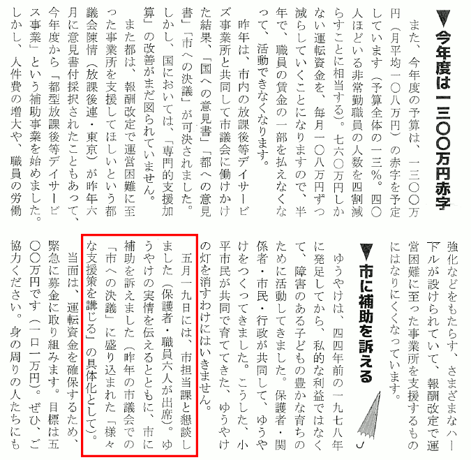
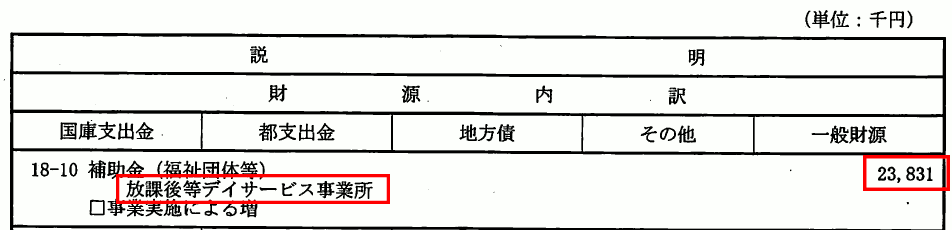

{{first:2021-09-06}}

# 議員提出議案第41号　放課後等デイサービス等の報酬改定について、小平市に支援策などを求める決議について

<i class="fa fa-gavel" aria-hidden="true"></i> 厚生委員会付託

📄会議録（<a href="https://ssp.kaigiroku.net/tenant/kodaira/SpMinuteView.html?council_id=1240&schedule_id=2&minute_id=587&is_search=true">初日</a>｜<a href="https://ssp.kaigiroku.net/tenant/kodaira/SpMinuteView.html?council_id=1244&schedule_id=2&minute_id=181&is_search=true">委員会</a>｜<a href="https://ssp.kaigiroku.net/tenant/kodaira/SpMinuteView.html?council_id=1240&schedule_id=6&minute_id=690&is_search=true">最終日</a>）

<fieldset class="pnt">
  <legend><h2>ポイント</h2></legend>

国の報酬改定により負の影響を受ける放課後等デイサービス等について、市に支援を求める決議です。決議というのは、議会の意思を表明するもので、市に対して強制力があるわけではありませんが、周知を含めて、一定の意味があるものです。橋本久雄議員の提案により、私（安竹）が提出者代表議員として議案を提出しました。

この議案を出すことになった発端は、市内で放課後等デイサービスを営まれている、歴史のある[ゆうやけ子どもクラブ](https://www.yuyake-kodomo.club/)よりご相談を受けたことです。国の報酬改定により、市内の放課後等デイサービス事業者については報酬が大幅に減となります。これまでの運営が続けられなくなってしまう事業者が多いため、市に支援を求める請願を出したいということでした。

それはぜひ出しましょうということで話が進んでいましたが、その後、ほかの会派から「請願ではなく意見書として出した方がよい」という説得があったようです。私も橋本議員も、都や国に対する意見書は実効性も不明なので、市に対して請願を出すという実効性の確かな方法を勧めました。請願であれば、署名活動を通して市民に周知も行えますが、意見書は基本的に署名は集めないという違いもあります。しかし、請願は出さず意見書を出すという結論になりました。

そこで、議員の側から、市に支援を求める決議を出すことにした、というのが今回の提案です。ゆうやけ子どもクラブとしては、放課後等デイサービス以外にも報酬改定が行われている中で、自分たちだけ強く主張できないというご意見をいただいていましたので、純粋に議員の側からの提案という形で、提出したものです。

この議案は、文言修正するため9月定例会最終日に[議員提出議案第46号](./gian-46.md)として再提出し、11月4日の厚生委員会で全会一致となったため、12月定例会最終日に議員提出議案第50号として再提出され、全会一致で可決しました。

---

**［後日談①（令和4年5月31日）］**

ゆうやけ子どもクラブが発行しているゆうやけだより（2022年5月31日号）によると、令和4年5月19日に、この決議の内容について、市と懇談会を行ったそうです（下に抜粋しました）。できれば私たちも同席したかったところではありますが、決議を出した意味がひとつあったようで、よかったと思います。

---

**［後日談②（令和4年9月6日）］**

令和4年度の第4号補正予算（案）において、この決議を受けた形で、『放課後等デイサービス事業所臨時対策補助事業』として、市内の放課後等デイサービス事業所に対する臨時の補助金約2,400万円が計上されていました！！

9事業所で単純に平均すると約270万円。ゆうやけ子どもクラブの不足分が約1,300万円としていますので、その約4分の1になるのかなと思います。詳細は総務委員会で質問があれば分かりますが、4分の1というと、報酬における市の負担割合と一致しますので、もしかすると、市がこれまで負担してきた額なのではないかと思われます。

金額も限られており、一回限りの支給ということですので、継続した支援や拡充を求めていきますが、決議を受けて、ひとまず市が動いてくれたので、よかったと思います。

---

**［後日談③（令和4年9月6日）］**

9月定例会に、放課後等デイサービスの支援を求める請願『放課後等デイサービス事業所への支援を求めることについて』が出されました。

一人会派の会からは、伊藤議員が紹介議員として名を連ねています。決議に尽力してきた身としては、今回の請願に名を連ねられないことは少し残念ですが（紹介議員を誰にするか、事前のご確認がなかったようです（？））、もちろん賛同しています。次のサイトで署名集めもされていますので、ご賛同の方はご協力をお願いいたします。

[ゆうやけ子どもクラブ署名ページ](https://www.yuyake-kodomo.club/donation-em.html)

</fieldset>

目次

- [提案理由の説明](#提案理由の説明)・[資料](#資料)
- [主な質疑](#主な質疑)
- [付託委員会での取り扱い](#付託委員会での取り扱い)
- [本会議での主なやり取り](#本会議での主なやり取り)

## 提案理由の説明

<blockquote>

（安竹洋平議員）

まず誤解がないように述べておくんですけれども、これは放課後等デイサービスの事業をされている方から御要望があったから出しているものということではなくて、ご要望があれば請願という形になるはずだと思うんですけれども、そうじゃなく、当会派の橋本久雄議員のほうから問題だということで提起されて、水口議員も賛同してくださっているものです。もちろん私も賛同しています。

前提の話は、これは先ほど採択された意見書と同じですね。意見書のほうは、東京都に求めるもので、東京都も問題を把握しているという話もあるんですけれども、対応するまでには時間がかかると。市の中での現状に少しでも対応するためのものです。

放課後等デイサービスのように、急激に報酬が変わってしまう事業所にとっては、これまでとやっていることは変わらないのに、人を急遽減らしたりとかサービスを減らしたりしなければいけないことになります。そういった事業者と利用者の間で、福祉が急激に低下することになります。

激変緩和と書いてあるんですけれども、どれくらいといったところは市で考えてもらうということで、市の財政として、対応できる限り対応していただくことが望ましいと考えています。

以上ですので、皆様、御賛同のほどよろしくお願いいたします。

**厚生委員会での提出者代表議員の説明**

内容については、この後、川里議員のほうからお話があるところと全く同じことなんですけれども、議員提出議案第43号のほうは国に対して求めているもの。議員提出議案第42号は東京都に求めている意見書ということで、東京都と国に対しては要望していくけれども、対応までには時間がかかると。

実際に対応してもらえるのかどうかも分からない状況の中で、市のほうとしても、意見書で問題にされているような、たとえば放課後等デイサービスのように、急激に報酬が変わるような事業者さんがいらっしゃる。

これまでとやっていることは変わらないのに、急遽人を減らしたりとか、サービスを減らしたりしなければいけないということで、激変緩和と書いてあるんですけれども、少なくともという意味で、どれぐらいの対応をしていただくのかというところは、市で考えてもらうことが望ましいんですけれども、できる限り対応していただきたいというところの決議となります。

</blockquote>

## 資料

- [資料1](https://ssp.kaigiroku.net/tenant/kodaira/SpMaterial.html?tenant_id=165&power_user=false&view_years=&council_id=1241&schedule_id=20&minute_id=1&is_search=true)
- [資料2](https://ssp.kaigiroku.net/tenant/kodaira/SpMaterial.html?tenant_id=165&power_user=false&view_years=&council_id=1241&schedule_id=25&minute_id=1&is_search=true)

## 主な質疑
{{#include ../partials/situgi-note.md}}

主な質疑の目次

[1. 本会議での主な質疑](#1-本会議での主な質疑)

- なし

[2. 付託委員会での主な質疑](#2-付託委員会での主な質疑)

- [2.1. 提出者代表議員に対する質疑](#2-1-提出者代表議員に対する質疑)
    - hitori:[報酬改定で市内の何事業所が影響を受けるか](#報酬改定で市内の何事業所が影響を受けるか)
    - [この議案が出された経緯は](#この議案が出された経緯は)
    - [9ある市内事業者は、この決議提案について知っているか](#9ある市内事業者はこの決議提案について知っているか)
    - [事業者の納得を得てから決議を出した方がよいのでは](#事業者の納得を得てから決議を出した方がよいのでは)
    - [決議を出すことを丁寧に確認してからでもよいのでは](#決議を出すことを丁寧に確認してからでもよいのでは)
    - [激変緩和措置とあるが、どういう内容を想定しているか](#激変緩和措置とあるがどういう内容を想定しているか)
    - [激変緩和措置という表現だと、いろいろな解釈ができてしまうのでは](#激変緩和措置という表現だといろいろな解釈ができてしまうのでは)
    - [激変緩和措置という表現を、より具体性を持たせたものに変更できるか](#激変緩和措置という表現をより具体性を持たせたものに変更できるか)
    - [1項目と2項目で齟齬があるのでは](#1項目と2項目で齟齬があるのでは)
    - [155の事業所全部に、先方の意向も聞かず、何らかの措置をしてくださいということか](#155の事業所全部に先方の意向も聞かず何らかの措置をしてくださいということか)
    - [市に4分の1を負担してくれということか](#市に4分の1を負担してくれということか)
    - [激変緩和措置というのは、お金を出す以外のことも想定しているか](#激変緩和措置というのはお金を出す以外のことも想定しているか)
    - [都で陳情が通っているが、それでもやるべきか](#都で陳情が通っているがそれでもやるべきか)

- [2.2. 理事者側の説明](#2-2-理事者側の説明)
    - [放課後等デイサービスの規模や現状等について](#放課後等デイサービスの規模や現状等について)
    - [令和3年度報酬改定の経緯について](#令和3年度報酬改定の経緯について)

- [2.3. 理事者側に対する質疑](#2-3-理事者側に対する質疑)
    - hitori:[見直し要請を受け、国の動きはあるか](#見直し要請を受け国の動きはあるか)
    - hitori:[陳情を受けて、都の動きは](#陳情を受けて都の動きは)
    - hitori:[市の令和3年度当初予算が前年度比で増えているのは、改定の影響があるか](#市の令和3年度当初予算が前年度比で増えているのは改定の影響があるか)
    - hitori:[放課後等デイサービス以外の分野で大幅な減収になる事業所は](#放課後等デイサービス以外の分野で大幅な減収になる事業所は)
    - hitori:[155事業に関し、負担が増えるか減るかの差はどれだけあるか](#155事業に関し負担が増えるか減るかの差はどれだけあるか)
    - hitori:[一定の支援策が必要という認識はあるか](#一定の支援策が必要という認識はあるか)
    - hitori:[国は、今回報酬改定したので、すぐ変更することはないという理解でよいか](#国は今回報酬改定したのですぐ変更することはないという理解でよいか)
    - [専門的な資格を持った職員を確保するのは困難では](#専門的な資格を持った職員を確保するのは困難では)
    - [3年に一度の改訂を待っていたら潰れる事業所もあるのでは](#3年に一度の改訂を待っていたら潰れる事業所もあるのでは)
    - [12月4日に行われる仕事相談会はどういうものか](#12月4日に行われる仕事相談会はどういうものか)

{{#include ../partials/toc-note.md}}

<a class="header" href="#1-本会議での主な質疑">1. 本会議での主な質疑</a>

なし。

<a class="header" href="#2-付託委員会での主な質疑">2. 付託委員会での主な質疑</a>

この議案は厚生委員会に付託されました。主な質疑を記します。一人会派の会からは、橋本久雄議員が委員として参加しました。

<a class="header" href="#2-1-提出者代表議員に対する質疑">2.1. 提出者代表議員に対する質疑</a>

#### 報酬改定で市内の何事業所が影響を受けるか

国の制度が元に戻らない場合、市は4分の1負担がなくなる。基礎自治体である市が、そこで事業をしているデイサービス等の団体が全額負担をかぶる。何らかのサポートをするのは当然のこと。

市では何事業所が影響を受けることになるか。

[令和3年度障害福祉サービス等報酬改定等に関するQ＆A](https://www.mhlw.go.jp/content/000763133.pdf)に挙げられているのが、訪問系サービスに関しては、重度訪問介護とか行動援護、それから日中活動系サービス、療養介護に関しては生活介護とか短期入所、療養介護、それから施設系居住支援系サービスに関しては、施設入所支援、共同生活援助、自立生活援助とか、あと障害児支援に関しては、障害児通所支援とか障害児入所施設といったところが挙げられている。

私も、詳しい数までは分からないので、理事者側に聞いていただきたい。

#### この議案が出された経緯は

この議案が出された経緯は。

もともとは、事業者の方が請願を出したいという話があった。しかし、途中から、意見書にするということになった。

ただ、都が対応し、国が対応し、というまでには時間がかかり、果たして本当に実現するか分からない。

しかし、現状に対応する必要がある。今、人を切らなくてはならない、サービスの利用者数を減らさなければならないという状況に対応しなければならない。

市にも要望を出す必要があるということで、橋本久雄議員から提案があり、私もまったくそのとおりと考え、提案している。

#### 9ある市内事業者は、この決議提案について知っているか

9ある市内事業者は、今回この決議が出されることについては御存じか。そして、納得はされているか。

一部の事業者に関しては、そういった決議を出しますといった話はさせていただいている。そのときは、出してはいけないとか、そういった話はなかった。

納得されているかどうかは分からない。

ただ、実際に事業が大変で、人を切ったりしなくてはならないとおっしゃっていて、窮状にあることは明らかなので、この議案が通って、少しでも市が何らかの対応をしてくれることは、事業者にはメリットが大きいと思う。

ただ、この決議を出すことを、その事業者の提案でやっていると思われることはとても懸念されている。

ほかの事業者との関係の中で、自分だけが主張し、補助金みたいなものを得ようとしているとか、そう思われると、といったことをおっしゃっていたので、そういったところを気にされているのだろうとは思う。

しかし、この決議に反対というところまではいかないと思う。むしろ、利用者にとってもメリットになることと思う。

#### 事業者の納得を得てから決議を出した方がよいのでは

決議を出す場合は、極力、事業者に納得していただいてから出すという形がよいのではないか。

先ほど述べたように、事業者のほうで、この決議に大賛成ですという意見を表明しづらい立場上の問題がある。

ただ、最初に、請願を出そうということで相談に来られた際の気持ちというのは、そういうことだと思う。

人を切ったり、利用者を減らさざるを得ない状況を避けたいということで、話に来られている。この決議は、その方向に合致したもの。

そういう意味では、大前提として、納得されている話と思うが、直接、納得されているかどうかは確認していない。

事業者の立場があるので、そのあたりは、意を酌んでいるところがあるのではないかと思う。

もし、事業者に不利益になるようなことが想像できて、事業者から「そういうことをやめてくれ」という声が上がっているようであれば、（やめるか）、事業者の納得は取り付けなくてはならないと思う。

そういったことがなく、利益になることが明らかなことに関して、その明らかをどこに基準を持ってくるのかという問題もあるが、事業者の納得の確認というものが、（決議という議員の意思を示すものにおいて）どこまで必要なのかとも感じる。

#### 決議を出すことを丁寧に確認してからでもよいのでは

9団体の事業所に、決議を出そうと思うが、ということを丁寧に確認を取ってもよかったのでは。

当事者の団体は、放課後等デイサービスのことを市民に広く知ってもらいたいという気持ちがあったり、市民の理解を得ながら、今後何を求めていくのか、具体的な提示ができるように自分たちでも考えてみたいという意見も聞いている。それはどう考えるか。

たしかにそういう側面はあるのかなと思う。一方で、9団体だけではないかもしれず、先ほど橋本久雄委員から質問があったように、今回の報酬改定で155の事業所が関連する。

放課後等デイサービスのように、急に人を切ったり、利用者を減らしたりしなきゃいけないといった事業所があるかもしれない。

そのあたりに関しては把握できていないので、実際に確認するなら、155の事業所に一つ一つ確認する必要があったのかなとは思う。現実的に時間の制限等もあるので難しいところかなと思う。

事業者が自分たちで考えてみたいと、そういったことはまた別で活動されてもよいと思う。

たとえば今回の決議が通った後に、新しく事業者が考えたことを、市に提案してやってくださいと言ったときに、すでにこっちの決議が通っているから、そっちはやりません、という話にはならない。そのあたりは、ぜひ提案いただければよいと思う。

#### 激変緩和措置とあるが、どういう内容を想定しているか

2項目に激変緩和措置という表現があるが、どのような内容を想定しているか。

市としても、報酬の改定で、全体としてどれぐらい負担が増えるのか分からないが、負担がすごく増え、市として対応できない、となるかもしれない。

今後、国や都が、意見書で出したようなことを実現し、元に戻す部分も出てくるかもしれない。しかし、それまでの間、市がすべてバックアップしてお金を出すということになると、非常に大きな負担になる可能性もある。

ほかにうまい表現があれば提案いただきたいが、人を切ったり、急激な変化を事業者に起こさないような、できる限りのという意味で、激変緩和という表現を使っている。

#### 激変緩和措置という表現だと、いろいろな解釈ができてしまうのでは

激変緩和措置という表現だと、具体的なイメージが分かりにく、いろいろな解釈ができてしまうのでは。

私たちもまだ全体像というか、報酬改定に関してどれだけの事業者がどういう影響を受けているのかというところは、詳細に把握していない。

そのあたりは市で考えてもらうことが、一番実現の可能性が高い、現実的ではないかというところで、あえて詳細には書いていない。

#### 激変緩和措置という表現を、より具体性を持たせたものに変更できるか

激変緩和措置という表現については、もう少し具体性を持たせるような内容に変更することは、可能か。

もちろん、よい表現があれば、提案いただけたら。

#### 1項目と2項目で齟齬があるのでは

1項目と2項目で、齟齬があるのではないかと感じる。

1項目は、5年以上経験のある保育士や児童指導員にも適用するように政府に働きかけること、実現を求めていくことはよいが、激変緩和措置というと、1が通らないから激変緩和措置として、と受け取りかねないが。

表現はいろいろあると思うので、提案いただければと思うが、1項目に書いてあるのは、将来的にこうなってほしいという理想。

理想を実現してほしいが、政治家としては、実現しなかった場合や、実現するまでのことも考えなくてはならない。2項目は、理想に対し、現状に対応するもの。

激変緩和というのは、市ができる限りの対応をしてくださいというのを短く書いたような形。

決議や請願等に関しても、市のほうでは全体を結構把握していて、言葉尻を捉えて何か対応するというより、趣旨をしっかり捉えて対応していることがこれまでもあった。

そういう意味では、今の議論で、激変緩和措置というものがどういう意味かというところが明らかになった。このままでも、市はそのあたりの意を酌んで、対応してくれるのではとも想像する。

事業者は激変緩和措置を求めているのではなく、まずは5年以上経験のあるという、1のほうを求めているはず。激変緩和は言葉を考えて、言ったほうがよいのでは。

おっしゃっるとおりかなというところがあるので、よい表現があれば、ぜひご提案を。

#### 155の事業所全部に、先方の意向も聞かず、何らかの措置をしてくださいということか

2項目にある「放課後等デイサービスに限定せず」は、155の事業所全部に、先方の意向も聞かず、何らかの措置をしてくださいという内容でよいのか。

実際、報酬改定でマイナスになるところとプラスになるところがある。全体像を把握できていないが、多分プラスになるほうが多い、というところがあある。

ただ、放課後等デイサービスのように、利用者数をかなり減らさなくてはいけないような状況があるので、そういったところを重点的に見ていく必要がある。

市のほうでは、急激に報酬がカットされるようなところに関しては意向を聞き、どういう状況なのか確認し、どういうサポートが必要なのかを見ていただき、手当てをしていただければよいと考えている。

#### 市に4分の1を負担してくれということか

橋本久雄委員の発言を聞いていると、4分の1の負担を出してくださいよと言っているのか、それとも、少なくなった分を市が持ってくださいという内容なのか、その辺が分かりにくかったので、考えは。

報酬改訂で市の財政支出が増えるところと、支出が減るところがあると思う。そういったところを総合的に勘案し、たとえば放課後等デイサービスのように、市の支出が大きく減るところに関しては、全額というわけではないが、総合的に考えて、出せる限りの手当していただきたいということ。4分の1全部出してくれとか、そういうことではない。

#### 激変緩和措置というのは、お金を出す以外のことも想定しているか

激変緩和措置というのは、お金を出すということか。それ以外のことも想定しているか。

お金を出す以外のことについては考えていない。

#### 都で陳情が通っているが、それでもやるべきか

都は陳情が全会一致になって進める。すると、第2回定例会でやっているので、これから市がいろいろ調べて確認し、予算措置をしてやるのと、どっちが早いのかと思うが、それでもこれをやるべきなのか。

都で進めていることも、まだ確定したわけではなく、いつそれが実現するか分からない。もしかすると都が早く決めて、市が対応するよりも早く対応するかもしれないが、都が対応しない可能性もある。

確実性のあるほうとしては、実際に実現するまでの間、市にサポートしてもらう方向で進めるのがよいと思う。

もうひとつは、155事業所がある。都では放課後等デイサービスのことに関しては進めているかもしれないが、それ以外の影響を受ける可能性のある事業所に関しては、なかなか動きがあるのかどうか、私も把握していない。しかし、ほかの事業所のことも考えると、全体的に一度、市のほうでも検証し、どうすべきかを考えてもらうのがよいと思う。

<a class="header" href="#2-2-理事者側の説明">2.2. 理事者側の説明</a>

#### 放課後等デイサービスの規模や現状等について

まず、放課後等デイサービスの規模や現状等について。

平成24年度の児童福祉法の改正以降、次のような状況で、大幅に増加し続けている。

| | 平成24年度 | 令和元年度 | 比率 |
|--- | --- | --- | ---|
| **全国の事業所数** | 2,887ヵ所 | 14,046ヵ所 | 約4.9倍 |
| **利用者数** | 53,590人 | 226,610人 | 約4.2倍 |
| **自立支援給付費** | 約476億円 | 約3,287億円 | 約6.9倍 |

小平市内の事業所数は令和3年4月現在で16ヵ所、定員数は合計165人、うち3ヵ所が、重症心身障害児対象の事業所で、定員数の合計は15人。

自立支援給付費は、市外の事業所に通所している利用者の方も含め、令和2年度の実績は約4億4,000万円で、前年度比で約4,470万円の増となる見込み。

#### 令和3年度報酬改定の経緯について

次に、令和3年度報酬改定の経緯について。

放課後等デイサービスは、原則3年ごとに報酬の改定が行われる。報酬改定に当たり、国は[障害福祉サービス報酬改定検討チーム会議](https://www.mhlw.go.jp/stf/shingi/other-syougai_446935_00001.html)を立ち上げ、サービスの動向や関係団体等へのヒアリングに加え、障害福祉サービス等の経営実態調査を行い、サービスごとの経営実態や制度の施行状況を把握し、これらを資料として検討チーム会議の委員から意見を聴取している。

この検討チーム会議および社会保障審議会障害者部会の意見を合わせ、報酬改定案を示しながら、さまざまな段階を経て改定が行われたもの。

報酬改定を受け、市では本年7月に市内の放課後等デイサービス事業者のうち、4ヵ所の事業者との意見交換において、都議会への陳情や国への意見、要望といったことを伺うとともに、多摩26市の障害福祉担当課長会議において、都の担当部署と意見交換を行った。

また、都が放課後等デイサービス事業者に対する調査を実施している状況等を把握している。

<a class="header" href="#2-3-理事者側に対する質疑">2.3. 理事者側に対する質疑</a>

#### 見直し要請を受け、国の動きはあるか

国にはいろいろな関係団体から見直しを求める要請などが結構いっていると思うが、それを受けて国として何か動きがあるか。

障害児の通所支援事業については、一定の減収になるような改定をしたことについて、厚労省としても捉えているということで、すでに障害児通所支援に関する在り方検討会を始めている。

#### 陳情を受けて、都の動きは

都で全会一致で可決している陳情の中にある支援策はどういうものか。陳情を意見付き採択されたことで、都が具体的にどのような対応を今検討しているのか。

都が放課後等デイサービスに対する調査を行っている。その結果の内容は、市にも情報提供されている。今後、支援策をどのように行っていくかについては、現在情報はない。

#### 市の令和3年度当初予算が前年度比で増えているのは、改定の影響があるか

市の当初予算は令和2年度と比べて令和3年度が若干多くなっている。これは事業者数が増えたから多くなったのか。もしくは、この改定で、マイナスよりプラスになるところが多いから増えたのか。

令和2年度に令和3年度の予算要求額の積算をした。同時に計画の策定においても障害福祉サービス見込量を捉えながら、障害者、障害児の増加、障害福祉サービス利用者の増加、事業所数の増加という状況の中で、基本的には右肩上がりになっていくという方向と捉え、数字的には伸び率を見ながら、当初予算を計上している。

#### 放課後等デイサービス以外の分野で大幅な減収になる事業所は

9団体の方が、初め、請願を出したいという話をした中で、ひとつの事業所は年間1,300万円減収になると聞いた。人権費で3人分ぐらい。この状態の中で運営していくのは困難。

放課後等デイサービスに限らず、ほかの分野でも、そういう大幅な減収になる事業所はどのぐらいあるか。

詳細は今、手元にないが、国が開催した、[令和2年度障害福祉サービス等報酬改定検討チーム会議](https://www.mhlw.go.jp/stf/shingi/other-syougai_446935_00001.html)の中では、経営状況の実態調査を行い、平成28年度と令和元年度の決算の比較をしながら、収支差率及びその増減を見ている。

その中で、令和元年度決算の状況は、おおむね収支差率が減少傾向になってきているというところだったが、放課後等デイサービスおよびグループホームの日中サービス支援型の2つの事業だけが、10%以上の収支差率という結果になった。

このあたりに対する意見が報酬改定検討チーム会議の中で出され、そこへの対応として、報酬の見通しが図られたことと、同時に、財務省が放課後等デイサービスの経営状況、および、先ほど来話題になっている児童指導員の加算の仕組みについての調査を行い、結果として、財務省から、この2つの結果について適正化を図ってほしいということを厚生労働省に伝えている。

そういったこともあり、厚生労働省も、事業の報酬改定について積極的に動いたと印象を持っている。

#### 155事業に関し、負担が増えるか減るかの差はどれだけあるか

この155事業に関して、負担が増えるのか減るのか、差がどれくらいあるか。

具体的に数字的なものはないが、ほかの障害福祉サービスの事業所からは、特に大きく減らされてしまったとか、そういった相談はない。

ただし、コロナ禍の影響を受けている事業があり、行動援護や同行援護、地域生活支援事業の移動支援事業などは、利用控えが大きくあり、事業費の減少が続いている。

#### 一定の支援策が必要という認識はあるか

一定の支援策が必要という認識はあるか。

基本的には、国において3年ごとの時限措置で報酬を見直し改定している。市としては、特定のサービス事業所に対して補填を行うということは、公平性に欠けるものと考えているので、非常に困難と考えている。

ただし、なかなか財政的な支援はできないが、7月初旬に障害福祉担当課長会があり、ほかの市から、放課後等デイサービスについての大きな報酬減についての対応をどうするのかということを東京都に尋ねられていたので、小平市においても同様の話があり、平成30年度の報酬改定においても報酬減があったので、その辺の話と、なぜこういう報酬減になってしまったのかという理由を尋ねた。

都への陳情や、都における実態調査が行われたので、今後何らかの支援策を行う可能性もある。市としては、東京都への要望をしていくとともに、その支援策については注視していきたい。

加えて障がい者支援課では、12月4日に専門職の確保、要するに障害福祉サービス事業所の人材の確保ということを考えており、障害分野に特化した仕事相談会を、ルネこだいらで行うということを今現在計画している。

福祉人材の確保を目的とした相談会を各市でも行っているが、どうしても介護分野であるとか、保育分野であるとかに人材を取られてしまうところがある。今回は、単独で行うので、そういったところでのバックアップを考えていきたい。

#### 国は、今回報酬改定したので、すぐ変更することはないという理解でよいか

国としては、今回改定したので、この改定の内容を今すぐ変更することはないという理解でよいか。

報酬については3年間改定は行わないものと考えている。そのうえで、在り方検討会を現在続けている。

放課後等デイサービスのこれまでの経過を考えると、平成27年にガイドラインを策定している。

[放課後等デイサービスガイドライン（平成27年・厚生労働省）](https://www.mhlw.go.jp/stf/shingi2/0000082831.html)

その中で、さまざまな対応についての詳細が書かれているが、就学後の子どもから18歳までの子どもが通う割には、育ちに関する取組の方向性の記述がなく、利用者の年齢に応じた支援をどうやって行っていくのかということを事業所に委ねてしまっている。

たとえば学童クラブだと、厚労省が、たとえば約6歳から8歳の子どもへの配慮、それから9歳や10歳の子どもへの配慮、11歳、12歳の子どもへの配慮などの指針を示して活動をお願いしているが、放課後等デイサービスはそういうものがない。

また、新たな報酬体系の中にも、個別サポート加算2の中では、虐待等の要保護児童等への支援についての強化などの加算があるものの、要保護児童対策地域協議会に事業所として参加していなかったりする。そのあたりとの連携などの状況があり、今後も放課後等デイサービスの在り方については、詳細な議論がなされていくものと考えている。

#### 専門的な資格を持った職員を確保するのは困難では

専門的な資格を持った職員を人材確保するのは、現実的にはなかなか困難なところが多いのが実態なのではないか。

介護職、専門の資格を持っている方を雇うのが非常に難しいのは、現在私どものほうとしても重く受け止めている。そのため、国に支援策、都に対応をというところを、課長会等を通じて意見を述べていきたい。

また、事業所への聞き取りなど細かに行いながら対応していきたい。12月4日の仕事相談会の反響を見ながら、今後のことも考えていきたい。

#### 3年に一度の改訂を待っていたら潰れる事業所もあるのでは

すでに580万円も減収となっている事業所があり、3年に一度の報酬改定を待っていたら事業所が潰れてしまうことも十分にあり得るが、どうか。

現実的に、4月を経過して半年ぐらい過ぎてしまう状況で、大きな痛手を放課後等デイサービス事業所も負っていると考えている。

数字的なところは把握しており、事業所の皆様の御苦労は、身に染みている。市としても都や国の対応について注視していきたい。

#### 12月4日に行われる仕事相談会はどういうものか

12月4日の仕事相談会はどういうものか。

今、計画中の仕事相談会の内容については、詳細を答えられる段階に至っていないので、改めてお知らせする。

現段階においては、障害の分野に限らず、介護職や保育職など、なかなか定着しない、人材が集まらないといったこともあるので、事業所がそれぞれ不足している、雇いたい分野の人材の方へのPRを兼ねて行っていきたい。

## 付託委員会での取り扱い

質疑で上がった「激変緩和措置」といった表現の修正等を行うため、一度議案を撤回し、[議員提出議案第46号](./giin-gian-46.md)として、再度提出することとなりました。

## 本会議での主なやり取り

[議員提出議案第46号](./giin-gian-46.md)として、再度提出することとなりました。
